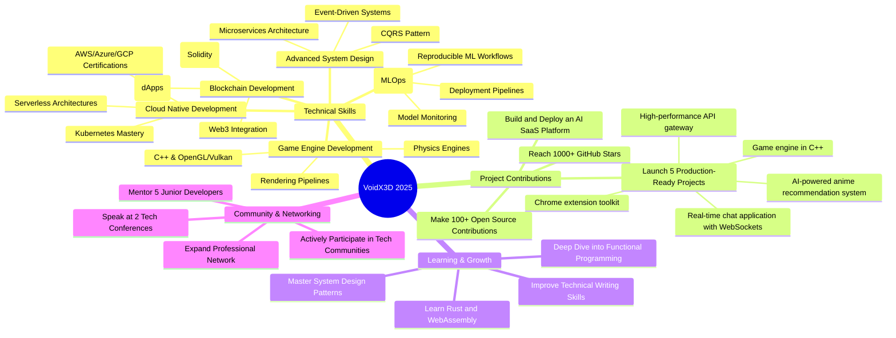

## 🎯 2025 Goals & Roadmap

My vision for 2025 involves significant growth in technical expertise, project contributions, and community engagement. I am committed to pushing my limits and achieving ambitious goals, both personally and professionally.

### Strategic Roadmap (Mindmap)

### Key Objectives for 2025

- **Launch 5 production-ready projects:** Focus on delivering high-quality, impactful applications.
- **Reach 1000+ GitHub stars:** Grow my open-source presence and contribute to the developer community.
- **Make 100+ open source contributions:** Actively engage with and improve existing projects.
- **Master system design patterns:** Deepen my understanding of scalable and resilient system architectures.
- **Build and deploy an AI SaaS platform:** Translate AI/ML knowledge into a commercial product.
- **Learn Rust and WebAssembly:** Expand my language proficiency for high-performance and web-native applications.
