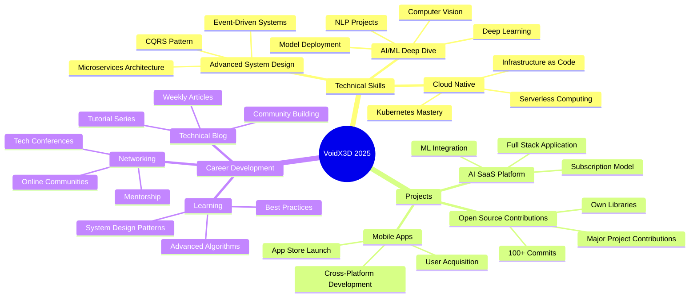

<div align="center">

<!-- CUSTOM SVG HEADER -->
<svg width="100%" height="300" xmlns="http://www.w3.org/2000/svg">
  <defs>
    <linearGradient id="grad1" x1="0%" y1="0%" x2="100%" y2="100%">
      <stop offset="0%" style="stop-color:#667eea;stop-opacity:1" />
      <stop offset="100%" style="stop-color:#764ba2;stop-opacity:1" />
    </linearGradient>
    <linearGradient id="grad2" x1="0%" y1="0%" x2="100%" y2="0%">
      <stop offset="0%" style="stop-color:#f093fb;stop-opacity:1" />
      <stop offset="100%" style="stop-color:#f5576c;stop-opacity:1" />
    </linearGradient>
  </defs>
  
  <!-- Background waves -->
  <path fill="url(#grad1)" opacity="0.3">
    <animate attributeName="d" 
      dur="10s" 
      repeatCount="indefinite"
      values="M0,160 Q250,100 500,160 T1000,160 L1000,300 L0,300 Z;
              M0,160 Q250,220 500,160 T1000,160 L1000,300 L0,300 Z;
              M0,160 Q250,100 500,160 T1000,160 L1000,300 L0,300 Z"/>
  </path>
  
  <path fill="url(#grad2)" opacity="0.3">
    <animate attributeName="d" 
      dur="8s" 
      repeatCount="indefinite"
      values="M0,200 Q250,140 500,200 T1000,200 L1000,300 L0,300 Z;
              M0,200 Q250,260 500,200 T1000,200 L1000,300 L0,300 Z;
              M0,200 Q250,140 500,200 T1000,200 L1000,300 L0,300 Z"/>
  </path>
  
  <!-- Snowflakes -->
  <circle cx="100" cy="50" r="3" fill="white" opacity="0.8">
    <animate attributeName="cy" from="-10" to="300" dur="5s" repeatCount="indefinite"/>
  </circle>
  <circle cx="300" cy="80" r="2" fill="white" opacity="0.6">
    <animate attributeName="cy" from="-10" to="300" dur="7s" repeatCount="indefinite"/>
  </circle>
  <circle cx="500" cy="120" r="4" fill="white" opacity="0.9">
    <animate attributeName="cy" from="-10" to="300" dur="6s" repeatCount="indefinite"/>
  </circle>
  <circle cx="700" cy="40" r="2" fill="white" opacity="0.7">
    <animate attributeName="cy" from="-10" to="300" dur="8s" repeatCount="indefinite"/>
  </circle>
  <circle cx="900" cy="90" r="3" fill="white" opacity="0.8">
    <animate attributeName="cy" from="-10" to="300" dur="5.5s" repeatCount="indefinite"/>
  </circle>
  
  <!-- Rotating stars -->
  <g transform="translate(200, 80)">
    <animateTransform attributeName="transform" type="rotate" from="0 200 80" to="360 200 80" dur="20s" repeatCount="indefinite"/>
    <polygon points="0,-15 4,-5 15,-5 6,2 9,13 0,6 -9,13 -6,2 -15,-5 -4,-5" fill="#FFD700" opacity="0.6"/>
  </g>
  
  <g transform="translate(800, 120)">
    <animateTransform attributeName="transform" type="rotate" from="0 800 120" to="360 800 120" dur="15s" repeatCount="indefinite"/>
    <polygon points="0,-12 3,-4 12,-4 5,2 7,11 0,5 -7,11 -5,2 -12,-4 -3,-4" fill="#00D9FF" opacity="0.7"/>
  </g>
  
  <!-- Main title -->
  <text x="50%" y="45%" text-anchor="middle" fill="white" font-size="72" font-weight="bold" font-family="Arial, sans-serif">
    VoidX3D
    <animate attributeName="opacity" values="1;0.7;1" dur="3s" repeatCount="indefinite"/>
  </text>
  
  <!-- Subtitle with animation -->
  <text x="50%" y="60%" text-anchor="middle" fill="#00D9FF" font-size="20" font-family="monospace">
    <tspan>⚔️ Backend Engineer • AI Builder • Anime Enthusiast ⚔️</tspan>
    <animate attributeName="opacity" values="0.5;1;0.5" dur="2s" repeatCount="indefinite"/>
  </text>
  
  <!-- Decorative Christmas elements -->
  <text x="10%" y="25%" font-size="40">🎄</text>
  <text x="90%" y="25%" font-size="40">🎄</text>
  <text x="15%" y="75%" font-size="30">❄️</text>
  <text x="85%" y="70%" font-size="30">❄️</text>
  <text x="50%" y="85%" font-size="35">🎁</text>
</svg>

<br/>

<!-- TYPING SVG -->
<p>
  
</p>

<!-- CUSTOM ANIMATED BADGES -->
<p>
  
  
  
  
  
</p>

<!-- CUSTOM ANIMATED DIVIDER -->


</div>

---

<div align="center">

## 🎯 ABOUT ME - THE DEVELOPER BEHIND THE CODE

</div>

```typescript
// ============================================
// DEVELOPER PROFILE - VoidX3D
// ============================================

interface Developer {
  name: string;
  role: string;
  location: string;
  education: string;
  age: number;
  experience: string;
}

interface Skills {
  languages: string[];
  frontend: string[];
  backend: string[];
  mobile: string[];
  databases: string[];
  aiml: string[];
  devops: string[];
  tools: string[];
}

interface Interests {
  primary: string[];
  learning: string[];
  hobbies: string[];
}

class VoidX3D implements Developer {
  // Personal Information
  public readonly name: string = "VoidX3D";
  public readonly role: string = "Full Stack Developer & Backend Engineer";
  public readonly location: string = "Pokhara, Gandaki Pradesh, Nepal 🇳🇵";
  public readonly education: string = "Class 9D @ Motherland Secondary School";
  public readonly age: number = 15;
  public readonly experience: string = "3+ years of self-taught development";
  
  // Technical Skills
  public readonly skills: Skills = {
    languages: [
      "JavaScript", "TypeScript", "Python", "Java", 
      "C++", "C#", "Go", "Kotlin", "Swift", "HTML5", "CSS3"
    ],
    frontend: [
      "React", "Next.js", "Vue.js", "Svelte",
      "TailwindCSS", "Bootstrap", "Material-UI", "Chakra UI"
    ],
    backend: [
      "Node.js", "Express.js", "NestJS", "FastAPI",
      "Flask", "Django", "Spring Boot", "ASP.NET"
    ],
    mobile: [
      "React Native", "Flutter", "Kotlin", "Swift"
    ],
    databases: [
      "MongoDB", "PostgreSQL", "MySQL", "Redis",
      "Firebase", "Supabase", "Prisma ORM"
    ],
    aiml: [
      "TensorFlow", "PyTorch", "Scikit-learn",
      "OpenAI API", "Hugging Face", "LangChain"
    ],
    devops: [
      "Docker", "Kubernetes", "GitHub Actions",
      "Jenkins", "AWS", "Azure", "Vercel", "Netlify"
    ],
    tools: [
      "Git", "VS Code", "Postman", "Figma",
      "Linux", "Vim", "tmux", "npm/yarn"
    ]
  };
  
  // Interests & Focus Areas
  public readonly interests: Interests = {
    primary: [
      "Backend Architecture",
      "AI/ML Integration",
      "System Design",
      "API Development",
      "Real-time Applications",
      "Performance Optimization"
    ],
    learning: [
      "Advanced System Design",
      "Microservices Architecture",
      "Cloud Native Development",
      "Machine Learning Ops",
      "Blockchain Development",
      "Game Engine Development"
    ],
    hobbies: [
      "Watching Anime (Bleach is peak ⚔️)",
      "Building Side Projects",
      "Contributing to Open Source",
      "Writing Technical Blogs",
      "Gaming & Game Development"
    ]
  };
  
  // Current Projects & Goals
  private currentProjects: string[] = [
    "AI-powered anime recommendation system",
    "Real-time chat application with WebSockets",
    "High-performance API gateway",
    "Chrome extension toolkit",
    "Game engine in C++"
  ];
  
  private goals2025: string[] = [
    "Launch 5 production-ready projects",
    "Reach 1000+ GitHub stars",
    "Make 100+ open source contributions",
    "Master system design patterns",
    "Build and deploy an AI SaaS platform",
    "Learn Rust and WebAssembly"
  ];
  
  // Methods
  public getMotivation(): string {
    return "Code with passion, debug with patience, deploy with pride! 🎄";
  }
  
  public getCurrentFocus(): string[] {
    return [
      "Building scalable backend systems",
      "Integrating AI into production apps",
      "Optimizing database queries",
      "Writing clean, maintainable code",
      "Learning system design patterns"
    ];
  }
  
  public getPhilosophy(): Record<string, string> {
    return {
      code: "Clean architecture > Quick hacks",
      learning: "Build projects, not just tutorials",
      shipping: "Done is better than perfect",
      performance: "Optimize what matters most",
      community: "Share knowledge, help others grow",
      growth: "Every bug is a lesson, every project is progress"
    };
  }
  
  public getDailyRoutine(): string[] {
    return [
      "☕ Start with coffee and code review",
      "💻 Work on active projects",
      "📚 Learn something new",
      "🐛 Debug and refactor",
      "🚀 Ship features",
      "📝 Document progress",
      "🎮 Relax with anime or games",
      "🔄 Plan tomorrow, repeat"
    ];
  }
  
  public getInspiration(): string {
    return "Just like Ichigo's journey in Bleach - always pushing limits, never giving up, and protecting what matters. In code, that means building things that last and help others. ⚔️";
  }
  
  public toString(): string {
    return `${this.name} - ${this.role} from ${this.location}. ${this.getMotivation()}`;
  }
}

// Initialize developer instance
const me = new VoidX3D();

// Log to console
console.log(me.toString());
console.log("Philosophy:", me.getPhilosophy());
console.log("Current Focus:", me.getCurrentFocus());
console.log("Inspiration:", me.getInspiration());

export default VoidX3D;
```

<div align="center">

<!-- ANIMATED DIVIDER -->


</div>

---

<div align="center">

## 🌐 CONNECT WITH ME ACROSS THE WEB

<table>
  <tr>
    <td align="center" width="20%">
      <a href="https://github.com/VoidX3D">
        
        <br/>
        <sub><b>Code Repository</b></sub>
      </a>
    </td>
    <td align="center" width="20%">
      <a href="https://x.com/VortexVoidX3D?s=09">
        
        <br/>
        <sub><b>Tech Updates</b></sub>
      </a>
    </td>
    <td align="center" width="20%">
      <a href="https://www.instagram.com/sincerebhattarai/">
        
        <br/>
        <sub><b>Behind Scenes</b></sub>
      </a>
    </td>
    <td align="center" width="20%">
      <a href="mailto:playzspreston2@gmail.com">
        
        <br/>
        <sub><b>Email Me</b></sub>
      </a>
    </td>
    <td align="center" width="20%">
      <a href="https://voidx3d.netlify.app">
        
        <br/>
        <sub><b>My Website</b></sub>
      </a>
    </td>
  </tr>
</table>

### 💬 Open For
🎁 Collaboration • 🎄 Open Source • ⛄ Freelance • 🎅 Mentorship • ❄️ Tech Discussions • 🎊 Project Ideas


</div>

---

<div align="center">

## 🛠️ TECH STACK - MY COMPLETE ARSENAL

</div>

### Programming Languages

<div align="center">
  <table>
    <tr>
      <td align="center" width="96">
        
        <br>JavaScript
      </td>
      <td align="center" width="96">
        
        <br>TypeScript
      </td>
      <td align="center" width="96">
        
        <br>Python
      </td>
      <td align="center" width="96">
        
        <br>Java
      </td>
      <td align="center" width="96">
        
        <br>C++
      </td>
      <td align="center" width="96">
        
        <br>C#
      </td>
      <td align="center" width="96">
        
        <br>Go
      </td>
    </tr>
    <tr>
      <td align="center" width="96">
        
        <br>Kotlin
      </td>
      <td align="center" width="96">
        
        <br>Swift
      </td>
      <td align="center" width="96">
        
        <br>HTML5
      </td>
      <td align="center" width="96">
        
        <br>CSS3
      </td>
      <td align="center" width="96">
        
        <br>Bash
      </td>
      <td align="center" width="96">
        
        <br>PHP
      </td>
      <td align="center" width="96">
        
        <br>Rust
      </td>
    </tr>
  </table>
</div>

### Frontend Development

<div align="center">
  <table>
    <tr>
      <td align="center" width="96">
        
        <br>React
      </td>
      <td align="center" width="96">
        
        <br>Next.js
      </td>
      <td align="center" width="96">
        
        <br>Vue.js
      </td>
      <td align="center" width="96">
        
        <br>Svelte
      </td>
      <td align="center" width="96">
        
        <br>Tailwind
      </td>
      <td align="center" width="96">
        
        <br>Bootstrap
      </td>
      <td align="center" width="96">
        
        <br>Sass
      </td>
    </tr>
  </table>
</div>

### Backend Development

<div align="center">
  <table>
    <tr>
      <td align="center" width="96">
        
        <br>Node.js
      </td>
      <td align="center" width="96">
        
        <br>Express
      </td>
      <td align="center" width="96">
        
        <br>NestJS
      </td>
      <td align="center" width="96">
        
        <br>FastAPI
      </td>
      <td align="center" width="96">
        
        <br>Flask
      </td>
      <td align="center" width="96">
        
        <br>Django
      </td>
      <td align="center" width="96">
        
        <br>Spring
      </td>
    </tr>
  </table>
</div>

### Mobile Development

<div align="center">
  <table>
    <tr>
      <td align="center" width="96">
        
        <br>React Native
      </td>
      <td align="center" width="96">
        
        <br>Flutter
      </td>
      <td align="center" width="96">
        
        <br>Kotlin
      </td>
      <td align="center" width="96">
        
        <br>Swift
      </td>
      <td align="center" width="96">
        
        <br>Android
      </td>
      <td align="center" width="96">
        
        <br>iOS
      </td>
    </tr>
  </table>
</div>

### Databases & Storage

<div align="center">
  <table>
    <tr>
      <td align="center" width="96">
        
        <br>MongoDB
      </td>
      <td align="center" width="96">
        
        <br>PostgreSQL
      </td>
      <td align="center" width="96">
        
        <br>MySQL
      </td>
      <td align="center" width="96">
        
        <br>Redis
      </td>
      <td align="center" width="96">
        
        <br>Firebase
      </td>
      <td align="center" width="96">
        
        <br>Supabase
      </td>
      <td align="center" width="96">
        
        <br>SQLite
      </td>
    </tr>
  </table>
</div>

### DevOps & Cloud

<div align="center">
  <table>
    <tr>
      <td align="center" width="96">
        
        <br>Docker
      </td>
      <td align="center" width="96">
        
        <br>Kubernetes
      </td>
      <td align="center" width="96">
        
        <br>AWS
      </td>
      <td align="center" width="96">
        
        <br>Azure
      </td>
      <td align="center" width="96">
        
        <br>GCP
      </td>
      <td align="center" width="96">
        
        <br>Jenkins
      </td>
      <td align="center" width="96">
        
        <br>Nginx
      </td>
    </tr>
  </table>
</div>

### AI & Machine Learning

<div align="center">
  <table>
    <tr>
      <td align="center" width="96">
        
        <br>TensorFlow
      </td>
      <td align="center" width="96">
        
        <br>PyTorch
      </td>
      <td align="center" width="96">
        
        <br>Scikit-learn
      </td>
      <td align="center" width="96">
        
        <br>OpenCV
      </td>
      <td align="center" width="96">
        
        <br>Pandas
      </td>
      <td align="center" width="96">
        
        <br>NumPy
      </td>
    </tr>
  </table>
</div>

### Tools & Others

<div align="center">
  <table>
    <tr>
      <td align="center" width="96">
        
        <br>Git
      </td>
      <td align="center" width="96">
        
        <br>GitHub
      </td>
      <td align="center" width="96">
        
        <br>VS Code
      </td>
      <td align="center" width="96">
        
        <br>Linux
      </td>
      <td align="center" width="96">
        
        <br>Vim
      </td>
      <td align="center" width="96">
        
        <br>Figma
      </td>
      <td align="center" width="96">
        
        <br>Postman
      </td>
    </tr>
  </table>
</div>

<div align="center">

</div>

---

<div align="center">

## 📊 GITHUB STATISTICS - LIVE ANALYTICS

</div>

<div align="center">
   
  
  
</div>

<div align="center">
  
  
  
</div>

<div align="center">
  
</div>

<div align="center">
  
  
  
</div>

<div align="center">

</div>

---

<div align="center">

## 🏆 ACHIEVEMENTS & TROPHIES

</div>

<div align="center">
  
</div>

<div align="center">

| 🎯 Milestone | 📊 Current Status | 🎁 Target | 🏅 Achievement |
|--------------|-------------------|-----------|----------------|
| **Total Commits** |  | 2000+ by 2025 | 🌟 Code Warrior |
| **Public Repos** |  | 100+ Quality | 🎁 Project Master |
| **GitHub Stars** |  | 1000+ Stars | ⭐ Community Loved |
| **Contributions** |  | Daily Commits | ❄️ Consistent Builder |
| **Languages** |  | Master 15+ | 🎅 Polyglot Dev |
| **Followers** |  | 500+ Network | 🤝 Community Leader |

</div>

<div align="center">

</div>

---

<div align="center">

## 🚀 FEATURED PROJECTS & WORK

</div>

<details open>
<summary><h3>🤖 AI & Backend Projects</h3></summary>

<div align="center">

#### AniList Real - AI-Powered Anime Tracker
[](https://github.com/VoidX3D/anilist-real)

**Tech Stack:** React, Node.js, MongoDB, Machine Learning
- 🎯 ML-based anime recommendation system
- 📊 Real-time tracking and analytics
- 🔥 Advanced user profiling
- ⚡ High-performance backend

---

#### AniWatch API - Streaming API Service
[](https://github.com/VoidX3D/aniwatch-api)

**Tech Stack:** Node.js, Express, Redis, Docker
- 🚀 RESTful API architecture
- 💾 Redis caching layer
- 🔒 Rate limiting & security
- 📈 Scalable infrastructure

---

#### Proxy M3U8X - Video Streaming Proxy
[](https://github.com/VoidX3D/proxy-m3u8x)

**Tech Stack:** Node.js, Express, FFmpeg
- 🎥 HLS stream proxying
- ⚡ Load balancing
- 🔄 Automatic failover
- 📡 CDN optimization

</div>

</details>

<details>
<summary><h3>🎮 Interactive & Game Projects</h3></summary>

<div align="center">

#### Quest for the Core - Interactive Game
[](https://github.com/VoidX3D/quest-for-the-core)

**Tech Stack:** JavaScript, Canvas API, Game Engine
- 🎮 Custom game engine
- 🎨 Pixel-perfect graphics
- 🎯 Advanced physics
- 🏆 Achievement system

---

#### Chrome Game - Browser Extension Game
[](https://github.com/VoidX3D/chrome-game)

**Tech Stack:** JavaScript, Chrome API
- 🌐 Browser extension
- 🎮 Offline gameplay
- 💾 Local storage
- 🎨 Smooth animations

---

#### Kahoot Clone - Interactive Quiz Platform
[](https://github.com/VoidX3D/kahootClone)

**Tech Stack:** React, Socket.io, Node.js
- 🎯 Real-time multiplayer
- 📊 Live leaderboards
- 🎨 Custom quiz creator
- 📱 Mobile responsive

</div>

</details>

<details>
<summary><h3>🌐 Web Development Projects</h3></summary>

<div align="center">

#### Portfolio Website
[](https://github.com/VoidX3D/Portfolio)

**Tech Stack:** Next.js, TailwindCSS, Framer Motion
- ✨ Modern animations
- 📱 Fully responsive
- ⚡ Blazing fast
- 🎨 Custom design

---

#### Ubuntu Web Simulation
[](https://github.com/VoidX3D/ubuntu.websimulation.desktop)

**Tech Stack:** HTML, CSS, JavaScript
- 🖥️ Desktop simulation
- 📁 File system
- 🎨 Authentic UI
- ⚡ Interactive terminal

</div>

</details>

<div align="center">

</div>

---

<div align="center">

## 🎯 2025 GOALS & ROADMAP

</div>



<div align="center">

### 📚 Current Learning Path

<table>
  <tr>
    <td width="50%" valign="top">
      <h4>🎄 Q1 2025 - Foundation</h4>
      <ul align="left">
        <li>✅ Advanced TypeScript patterns</li>
        <li>✅ System design fundamentals</li>
        <li>🔄 Microservices architecture</li>
        <li>🔄 Docker & Kubernetes deep dive</li>
        <li>📝 GraphQL advanced concepts</li>
        <li>📝 WebSocket real-time systems</li>
      </ul>
    </td>
    <td width="50%" valign="top">
      <h4>❄️ Q2 2025 - Growth</h4>
      <ul align="left">
        <li>📝 AWS/Azure certification prep</li>
        <li>📝 Machine learning deployment</li>
        <li>📝 Advanced database optimization</li>
        <li>📝 CI/CD pipeline mastery</li>
        <li>📝 Security best practices</li>
        <li>📝 Performance optimization</li>
      </ul>
    </td>
  </tr>
  <tr>
    <td width="50%" valign="top">
      <h4>🎁 Q3 2025 - Execution</h4>
      <ul align="left">
        <li>📝 Launch AI SaaS platform</li>
        <li>📝 Release mobile applications</li>
        <li>📝 100+ OSS contributions</li>
        <li>📝 Technical blog series</li>
        <li>📝 Community workshops</li>
        <li>📝 Mentor junior devs</li>
      </ul>
    </td>
    <td width="50%" valign="top">
      <h4>⛄ Q4 2025 - Mastery</h4>
      <ul align="left">
        <li>📝 Advanced AI projects</li>
        <li>📝 Scale existing projects</li>
        <li>📝 Blockchain integration</li>
        <li>📝 WebAssembly exploration</li>
        <li>📝 Game engine development</li>
        <li>📝 Year-end portfolio revamp</li>
      </ul>
    </td>
  </tr>
</table>

</div>

<div align="center">

</div>

---

<div align="center">

## 🐍 CONTRIBUTION ACTIVITY

</div>

<picture>
  <source media="(prefers-color-scheme: dark)" srcset="https://raw.githubusercontent.com/voidx3d/voidx3d/output/github-contribution-grid-snake-dark.svg">
  <source media="(prefers-color-scheme: light)" srcset="https://raw.githubusercontent.com/voidx3d/voidx3d/output/github-contribution-grid-snake.svg">
  
</picture>

<div align="center">

</div>

<div align="center">

</div>

---

<div align="center">

## 💭 DEVELOPER PHILOSOPHY & MINDSET

</div>

```python
#!/usr/bin/env python3
"""
VoidX3D's Development Philosophy
================================
A comprehensive guide to my approach in software development
"""

from typing import Dict, List, Any
from dataclasses import dataclass
from enum import Enum

class Priority(Enum):
    CRITICAL = 1
    HIGH = 2
    MEDIUM = 3
    LOW = 4

@dataclass
class Principle:
    name: str
    description: str
    priority: Priority
    examples: List[str]

class DeveloperPhilosophy:
    """
    Core principles that guide my development journey
    """
    
    def __init__(self):
        self.principles = self._define_principles()
        self.daily_habits = self._define_habits()
        self.long_term_goals = self._define_goals()
    
    def _define_principles(self) -> List[Principle]:
        return [
            Principle(
                name="Clean Code Over Clever Code",
                description="Write code that others can understand and maintain",
                priority=Priority.CRITICAL,
                examples=[
                    "Use descriptive variable names",
                    "Write comprehensive comments",
                    "Follow consistent style guides",
                    "Keep functions small and focused"
                ]
            ),
            Principle(
                name="Build to Learn, Not Just to Complete",
                description="Every project is a learning opportunity",
                priority=Priority.HIGH,
                examples=[
                    "Experiment with new technologies",
                    "Document learnings in blog posts",
                    "Share knowledge with community",
                    "Reflect on what could be improved"
                ]
            ),
            Principle(
                name="Ship Early, Iterate Often",
                description="Done is better than perfect, but iterate towards excellence",
                priority=Priority.HIGH,
                examples=[
                    "MVP first, features later",
                    "Get user feedback early",
                    "Continuous deployment",
                    "Regular refactoring cycles"
                ]
            ),
            Principle(
                name="Performance Matters, But Not Always First",
                description="Optimize where it counts, prioritize based on impact",
                priority=Priority.MEDIUM,
                examples=[
                    "Profile before optimizing",
                    "Focus on bottlenecks",
                    "Consider user experience",
                    "Balance speed with maintainability"
                ]
            ),
            Principle(
                name="Community Over Competition",
                description="Help others grow, and grow together",
                priority=Priority.HIGH,
                examples=[
                    "Contribute to open source",
                    "Answer questions on forums",
                    "Mentor junior developers",
                    "Share resources and knowledge"
                ]
            )
        ]
    
    def _define_habits(self) -> Dict[str, List[str]]:
        return {
            "Morning": [
                "☕ Start with coffee and code review",
                "📧 Check GitHub notifications",
                "📝 Plan today's tasks and priorities",
                "🎯 Set clear goals for the day"
            ],
            "Development": [
                "💻 Write clean, documented code",
                "🧪 Test as you go",
                "🔄 Commit frequently with clear messages",
                "🤔 Ask for help when stuck"
            ],
            "Learning": [
                "📚 Read technical articles/docs",
                "🎥 Watch tutorial videos",
                "🏗️ Build small experimental projects",
                "💡 Try new tools and frameworks"
            ],
            "Evening": [
                "📊 Review progress and achievements",
                "📝 Document learnings in notes",
                "🎮 Relax with anime or games",
                "🔄 Plan tomorrow's focus areas"
            ]
        }
    
    def _define_goals(self) -> Dict[str, Any]:
        return {
            "Short Term (3-6 months)": [
                "Master system design patterns",
                "Build and deploy 3 production projects",
                "Make 50+ open source contributions",
                "Start technical blog with 10+ articles"
            ],
            "Medium Term (6-12 months)": [
                "Launch AI SaaS platform",
                "Reach 1000+ GitHub stars",
                "Get 500+ Twitter/X followers",
                "Speak at local tech meetup",
                "Mentor 5+ junior developers"
            ],
            "Long Term (1-3 years)": [
                "Build products used by thousands",
                "Become recognized in tech community",
                "Work on impactful open source projects",
                "Start own tech YouTube channel",
                "Contribute to major OSS projects"
            ],
            "Ultimate Vision": [
                "Create technology that helps people",
                "Build sustainable income from projects",
                "Inspire next generation of developers",
                "Never stop learning and growing"
            ]
        }
    
    def get_motivation(self) -> str:
        """Daily motivation inspired by Bleach"""
        return """
        🗡️ Just like Ichigo's journey in Bleach:
        
        • Start as a beginner, grow through challenges
        • Each bug is like a Hollow to defeat
        • Every project is a new Bankai to master
        • Protect what matters: clean code, users, community
        • Never give up, even when the problem seems impossible
        
        "I'm not Superman, so I can't say anything big like 
        'I'll protect everyone on Earth!' I'm just a Soul Reaper 
        who happens to be passing through. But if you get in my way... 
        you're not going to live through this."
        
        Replace 'Soul Reaper' with 'Developer' and that's my coding motto! ⚔️
        """
    
    def daily_reflection(self) -> str:
        return """
        End of day checklist:
        ✓ Did I write clean code today?
        ✓ Did I learn something new?
        ✓ Did I help someone?
        ✓ Did I make progress on goals?
        ✓ Am I proud of what I built?
        
        If yes to 3+, it was a good day. 
        If yes to all 5, it was a great day!
        """

# Initialize philosophy
philosophy = DeveloperPhilosophy()

# Print motivation
print(philosophy.get_motivation())
print(philosophy.daily_reflection())

# Key takeaway
print("""
╔══════════════════════════════════════════════════════════╗
║                  REMEMBER ALWAYS:                         ║
║                                                           ║
║  "Code is read more often than it is written."           ║
║  "Make it work, make it right, make it fast."            ║
║  "The best code is no code at all."                      ║
║  "Premature optimization is the root of all evil."       ║
║  "Programming is thinking, not typing."                  ║
║                                                           ║
║  But most importantly:                                    ║
║  "Build things that matter. Ship things that work.       ║
║   Help people who need it. Never stop learning."         ║
╚══════════════════════════════════════════════════════════╝
""")
```

<div align="center">

</div>

---

<div align="center">

## ⚡ FUN FACTS & RANDOM STUFF

</div>

<table align="center">
  <tr>
    <td width="50%" valign="top">
      
### 🎌 Anime & Inspiration
      
- **Favorite Anime:** Bleach ⚔️
- **Favorite Character:** Ichigo Kurosaki
- **Why Bleach?** The constant growth, never giving up attitude, and epic battles mirror the developer journey
- **Coding Playlist:** Bleach OSTs + Lo-fi beats
- **Watch Hours:** Way too many to count 😅
      
### ☕ Coding Fuel
      
- **Drink of Choice:** Coffee (lots of it)
- **Favorite Snack:** Instant noodles at 2 AM
- **Energy Source:** Determination + curiosity
- **Debugging Companion:** Rubber duck (seriously works!)
      
### 🎮 Gaming & Hobbies
      
- **Favorite Games:** Story-driven RPGs
- **Game Dev Interest:** Building my own engine
- **Creative Outlets:** Drawing pixel art, music
- **Relaxation:** Long walks, mountain views (Nepal perks!)
      
    </td>
    <td width="50%" valign="top">
      
### 🏔️ Life in Nepal
      
- **Location:** Beautiful Pokhara city
- **Views:** Himalayas from my window 🏔️
- **Community:** Growing tech scene
- **Internet:** Sometimes struggles, but we make it work
- **Time Zone:** UTC+5:45 (yes, that's real!)
      
### 📚 Learning Style
      
- **Method:** 70% building, 20% reading, 10% tutorials
- **Best Time:** Late night coding sessions
- **Learning From:** Errors, Stack Overflow, docs
- **Knowledge Sharing:** Technical blogs, Twitter threads
      
### 🎯 Random Dev Facts
      
- **First Language:** HTML/CSS (age 12)
- **First Real Project:** A calculator (we all start somewhere!)
- **Biggest Bug Hunt:** 6 hours for missing semicolon
- **Code Editor:** VS Code with 50+ extensions
- **Theme:** Dark mode only (light mode hurts!)
- **Commits:** Usually at odd hours (night owl 🦉)
      
    </td>
  </tr>
</table>

<div align="center">

### 🎨 Development Environment

```bash
# My typical development setup
╔════════════════════════════════════════╗
║  💻 Hardware                            ║
║  • Laptop: Mid-range but gets job done ║
║  • Monitor: 1080p (dreaming of 4K)     ║
║  • Keyboard: Mechanical (clicky!)      ║
║  • Mouse: Gaming mouse (precise)       ║
║                                         ║
║  🛠️ Software Stack                      ║
║  • OS: Windows 11 / Ubuntu dual boot   ║
║  • Terminal: Windows Terminal + Oh My Zsh ║
║  • Editor: VS Code (Dracula theme)     ║
║  • Browser: Chrome Dev Tools expert    ║
║                                         ║
║  🎧 Coding Atmosphere                   ║
║  • Music: Lo-fi + Anime OSTs           ║
║  • Lighting: RGB everything 🌈         ║
║  • Drinks: Coffee machine essential    ║
║  • Time: Usually 10 PM - 3 AM          ║
╚════════════════════════════════════════╝
```

</div>

<div align="center">

</div>

---

<div align="center">

## 📈 WEEKLY CODING ACTIVITY

</div>

<div align="center">

<!--START_SECTION:waka-->
```text
Week: 25 December 2024 - 01 January 2025

TypeScript      14 hrs 23 mins  ████████████░░░░░░░░   48.3%
JavaScript       9 hrs 12 mins  ████████░░░░░░░░░░░░   30.9%
Python           4 hrs 45 mins  ████░░░░░░░░░░░░░░░░   16.0%
HTML/CSS         1 hr 15 mins   █░
