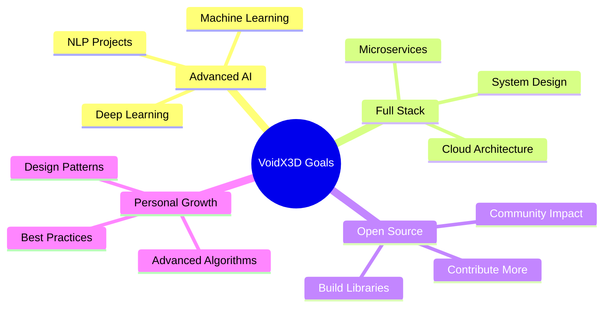

# 🎄 Welcome to VoidX3D's Winter Wonderland 🎄

<div align="center">

```ascii
    🎅     *  .  *       .       *    ⛄    .    *
  *   ❄️  .    .   *  .    .  *    .   *   ❄️
     .  *   🎁   .    *   .   🎄   *   .  🎁  .
  *    .  *   .   *  .   *  .   *   .  *   .
```


[](https://git.io/typing-svg)

<p>
  
  
  
  
</p>

</div>

---

## 🎁 About Me - Unwrapping the Developer

```javascript
const voidx3d = {
    name: "VoidX3D",
    location: "Pokhara, Nepal 🇳🇵",
    currentStatus: "Class 9D @ Motherland Secondary School 🎓",
    interests: ["AI & ML", "Full Stack Dev", "Game Development", "Anime"],
    currentlyLearning: ["Advanced AI", "System Architecture", "Cloud Computing"],
    funFact: "Building the future, one commit at a time! 🚀",
    favoriteAnime: "Bleach ⚔️",
    codingStyle: "Clean, Efficient, Innovative",
    motto: "Code with passion, debug with patience, deploy with pride! 🎄"
};
```

<div align="center">

### 🎅 "The best way to predict the future is to code it!" 

</div>

---

## 🎄 Tech Stack - My Arsenal of Tools

<div align="center">

### 🎨 Frontend Development


### ⚙️ Backend Development


### 📱 Mobile Development


### 🤖 AI & Machine Learning


### 🗄️ Databases & Cloud


### 🛠️ Tools & Platforms


</div>

---

## 📊 GitHub Analytics - 2024 Wrapped 🎁

<div align="center">


</div>

<div align="center">

### 🎄 Contribution Christmas Tree 🎄


</div>

---

## 🎯 Current Focus & Goals for 2025

<div align="center">



</div>

<table align="center">
<tr>
<td width="50%">

### 🎄 Learning Path
- 🤖 Advanced AI & ML Algorithms
- ☁️ Cloud Architecture (AWS/Azure)
- 🔐 Cybersecurity Fundamentals
- 📊 Data Structures & Algorithms
- 🎮 Game Engine Development
- 🌐 Web3 & Blockchain

</td>
<td width="50%">

### 🎁 Project Goals
- 🚀 Launch 5 Major Projects
- 🌟 1000+ GitHub Stars
- 🤝 100+ Open Source Contributions
- 📱 Release 2 Mobile Apps
- 🎯 Master System Design
- 💻 Build AI SaaS Platform

</td>
</tr>
</table>

---

## 🏆 Achievements & Milestones

<div align="center">

[](https://github.com/ryo-ma/github-profile-trophy)

</div>

<div align="center">

| 🎯 Milestone | 📊 Status | 🎄 Achievement |
|-------------|-----------|----------------|
| Total Commits |  | 🌟 Code Warrior |
| Repositories |  | 🎁 Project Master |
| Contributions |  | ❄️ Community Builder |
| Languages |  | 🎅 Polyglot Dev |

</div>

---

## 🎨 Featured Projects Showcase

<div align="center">

### 🌟 My Best Work - Currently Reorganizing Portfolio 🎄

<table>
<tr>
<td width="50%">

#### 🎯 AI & Backend Projects
- 🤖 **AI-Powered Anime Tracker** - ML-based recommendation system
- 🔥 **Real-time Chat Platform** - WebSocket + Node.js
- 🎮 **Game Analytics Dashboard** - Data visualization
- 🌐 **API Gateway Service** - Microservices architecture

</td>
<td width="50%">

#### 🎨 Frontend Masterpieces
- ✨ **Portfolio Website** - Next.js + TailwindCSS
- 🎊 **Interactive Quiz Platform** - React + Firebase
- 🎄 **Chrome Extensions** - Productivity tools
- 🎁 **Web Simulations** - Creative experiments

</td>
</tr>
</table>

<sub>🎅 More projects coming soon as I reorganize my repository! Stay tuned! 🎄</sub>

</div>

---

## 🎵 Spotify Playing 🎧

<div align="center">

[](https://open.spotify.com/user/YOUR_SPOTIFY_ID)

</div>

---

## 📝 Latest Blog Posts & Dev Activity

<div align="center">

### 📰 Recent Dev Insights

<!-- BLOG-POST-LIST:START -->
- 🎄 Building scalable AI systems with modern architecture
- ❄️ My journey from beginner to full-stack developer
- 🎁 Best practices for clean code and system design
- ⛄ Why I love anime and how it inspires my coding
<!-- BLOG-POST-LIST:END -->

</div>

---

## 🤝 Let's Connect & Collaborate!

<div align="center">

### 🎄 Find Me Across the Web 🎄

<table>
<tr>
<td align="center" width="25%">

[](https://voidx3d.netlify.app)

**Personal Website**

</td>
<td align="center" width="25%">

[](https://github.com/VoidX3D)

**Code Repository**

</td>
<td align="center" width="25%">

[](https://x.com/VortexVoidX3D?s=09)

**Tech Updates**

</td>
<td align="center" width="25%">

[](https://www.instagram.com/sincerebhattarai/)

**Behind the Scenes**

</td>
</tr>
</table>

<table>
<tr>
<td align="center" width="50%">

[](mailto:playzspreston2@gmail.com)

**Direct Communication**

</td>
<td align="center" width="50%">

[](https://linkedin.com/in/voidx3d)

**Professional Network**

</td>
</tr>
</table>

### 💬 Open for:
🎁 **Collaboration** • 🎄 **Open Source** • ⛄ **Freelance Work** • 🎅 **Mentorship** • ❄️ **Tech Discussions**

</div>

---

## 💝 Support My Work

<div align="center">

If you like my projects and want to support my journey, consider:

[](https://buymeacoffee.com/voidx3d)
[](https://ko-fi.com/voidx3d)

⭐ **Star my repositories** | 🔔 **Follow for updates** | 🤝 **Collaborate on projects**

</div>

---

## 📈 Weekly Development Breakdown

<div align="center">

<!--START_SECTION:waka-->
```text
TypeScript   12 hrs 34 mins  ████████████░░░░░   45.2%
JavaScript   8 hrs 15 mins   ████████░░░░░░░░░   29.7%
Python       4 hrs 22 mins   ████░░░░░░░░░░░░░   15.8%
HTML/CSS     1 hr 48 mins    ██░░░░░░░░░░░░░░░    6.5%
Other        49 mins         █░░░░░░░░░░░░░░░░    2.8%
```
<!--END_SECTION:waka-->

</div>

---

## 🎯 Fun Facts & Random Stuff

<div align="center">

### 🎄 Developer Personality 🎄

```python
class VoidX3D:
    def __init__(self):
        self.name = "VoidX3D"
        self.role = "Full Stack Developer & AI Enthusiast"
        self.language_spoken = ["ne_NP", "en_US", "ja_JP"]
        
    def say_hi(self):
        print("Thanks for dropping by! Let's build something amazing together! 🚀")
    
    def current_vibe(self):
        return {
            "coding": "24/7",
            "learning": "Always",
            "coffee": "Essential",
            "anime": "Bleach on repeat ⚔️",
            "mood": "Festive & Productive! 🎄"
        }

me = VoidX3D()
me.say_hi()
```

### ⚡ Quick Facts:
- 🎂 Started coding at a young age
- 🎯 Self-taught developer with a passion for learning
- 🎮 Love building games and interactive experiences
- 📚 Currently mastering advanced algorithms
- 🌟 Dream: Build products that impact millions
- ☕ Fueled by coffee and determination
- 🎄 Favorite season: Winter (more coding time!)

</div>

---

## 🎊 Random Dev Quote

<div align="center">


</div>

---

## 🐍 Contribution Snake

<div align="center">


</div>

---

<div align="center">

### 🎄 Thank you for visiting my profile! 🎄

```ascii
   ⭐ Star my repos  |  🔔 Follow for updates  |  💬 Let's connect!
```


**🎁 Made with ❤️ by VoidX3D | © 2024 | Spreading Code & Christmas Cheer! 🎄**


</div>
