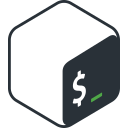
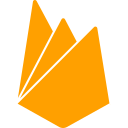
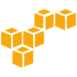

<div align="center">

<!-- ANIMATED SVG HEADER -->
<svg width="100%" height="320" viewBox="0 0 1000 320" xmlns="http://www.w3.org/2000/svg">
  <defs>
    <linearGradient id="bgGrad" x1="0%" y1="0%" x2="100%" y2="100%">
      <stop offset="0%" style="stop-color:#0d1117;stop-opacity:1" />
      <stop offset="50%" style="stop-color:#0a1929;stop-opacity:1" />
      <stop offset="100%" style="stop-color:#0d1117;stop-opacity:1" />
    </linearGradient>
    <linearGradient id="glowGrad" x1="0%" y1="0%" x2="100%" y2="0%">
      <stop offset="0%" style="stop-color:#00D9FF;stop-opacity:0" />
      <stop offset="50%" style="stop-color:#00D9FF;stop-opacity:0.8" />
      <stop offset="100%" style="stop-color:#00D9FF;stop-opacity:0" />
    </linearGradient>
    <linearGradient id="titleGrad" x1="0%" y1="0%" x2="100%" y2="0%">
      <stop offset="0%" style="stop-color:#00D9FF" />
      <stop offset="50%" style="stop-color:#8A2BE2" />
      <stop offset="100%" style="stop-color:#FF6B6B" />
    </linearGradient>
    <linearGradient id="wave1" x1="0%" y1="0%" x2="100%" y2="0%">
      <stop offset="0%" style="stop-color:#00D9FF;stop-opacity:0.15" />
      <stop offset="50%" style="stop-color:#8A2BE2;stop-opacity:0.15" />
      <stop offset="100%" style="stop-color:#FF6B6B;stop-opacity:0.15" />
    </linearGradient>
    <linearGradient id="wave2" x1="0%" y1="0%" x2="100%" y2="0%">
      <stop offset="0%" style="stop-color:#FF6B6B;stop-opacity:0.1" />
      <stop offset="50%" style="stop-color:#00D9FF;stop-opacity:0.1" />
      <stop offset="100%" style="stop-color:#8A2BE2;stop-opacity:0.1" />
    </linearGradient>
    <filter id="glow">
      <feGaussianBlur stdDeviation="3" result="coloredBlur"/>
      <feMerge>
        <feMergeNode in="coloredBlur"/>
        <feMergeNode in="SourceGraphic"/>
      </feMerge>
    </filter>
    <filter id="titleGlow">
      <feGaussianBlur stdDeviation="6" result="coloredBlur"/>
      <feMerge>
        <feMergeNode in="coloredBlur"/>
        <feMergeNode in="SourceGraphic"/>
      </feMerge>
    </filter>
  </defs>

  <!-- Background -->
  <rect width="1000" height="320" fill="url(#bgGrad)" rx="15"/>

  <!-- Animated wave 1 -->
  <path fill="url(#wave1)">
    <animate attributeName="d" dur="12s" repeatCount="indefinite"
      values="M0,280 Q125,240 250,260 T500,240 T750,260 T1000,240 L1000,320 L0,320 Z;
              M0,280 Q125,260 250,240 T500,260 T750,240 T1000,260 L1000,320 L0,320 Z;
              M0,280 Q125,240 250,260 T500,240 T750,260 T1000,240 L1000,320 L0,320 Z"/>
  </path>

  <!-- Animated wave 2 -->
  <path fill="url(#wave2)">
    <animate attributeName="d" dur="10s" repeatCount="indefinite"
      values="M0,290 Q150,260 300,280 T600,260 T900,280 L1000,270 L1000,320 L0,320 Z;
              M0,290 Q150,280 300,260 T600,280 T900,260 L1000,270 L1000,320 L0,320 Z;
              M0,290 Q150,260 300,280 T600,260 T900,280 L1000,270 L1000,320 L0,320 Z"/>
  </path>

  <!-- Floating particles -->
  <circle cx="150" cy="80" r="2" fill="#00D9FF" opacity="0.6">
    <animate attributeName="cy" from="-10" to="320" dur="8s" repeatCount="indefinite"/>
    <animate attributeName="opacity" values="0.6;0.2;0.6" dur="3s" repeatCount="indefinite"/>
  </circle>
  <circle cx="350" cy="50" r="1.5" fill="#8A2BE2" opacity="0.5">
    <animate attributeName="cy" from="-10" to="320" dur="11s" repeatCount="indefinite"/>
    <animate attributeName="opacity" values="0.5;0.1;0.5" dur="4s" repeatCount="indefinite"/>
  </circle>
  <circle cx="550" cy="120" r="2.5" fill="#FF6B6B" opacity="0.4">
    <animate attributeName="cy" from="-10" to="320" dur="9s" repeatCount="indefinite"/>
    <animate attributeName="opacity" values="0.4;0.1;0.4" dur="2.5s" repeatCount="indefinite"/>
  </circle>
  <circle cx="750" cy="40" r="1.8" fill="#00D9FF" opacity="0.7">
    <animate attributeName="cy" from="-10" to="320" dur="13s" repeatCount="indefinite"/>
    <animate attributeName="opacity" values="0.7;0.2;0.7" dur="3.5s" repeatCount="indefinite"/>
  </circle>
  <circle cx="880" cy="90" r="2" fill="#8A2BE2" opacity="0.5">
    <animate attributeName="cy" from="-10" to="320" dur="7s" repeatCount="indefinite"/>
    <animate attributeName="opacity" values="0.5;0.1;0.5" dur="4.5s" repeatCount="indefinite"/>
  </circle>

  <!-- Floating hexagon 1 -->
  <g transform="translate(180, 160)" opacity="0.15">
    <animateTransform attributeName="transform" type="rotate" from="0 180 160" to="360 180 160" dur="25s" repeatCount="indefinite"/>
    <polygon points="0,-20 17.3,-10 17.3,10 0,20 -17.3,10 -17.3,-10" fill="none" stroke="#00D9FF" stroke-width="1.5"/>
  </g>

  <!-- Floating hexagon 2 -->
  <g transform="translate(820, 180)" opacity="0.12">
    <animateTransform attributeName="transform" type="rotate" from="360 820 180" to="0 820 180" dur="30s" repeatCount="indefinite"/>
    <polygon points="0,-15 13,-7.5 13,7.5 0,15 -13,7.5 -13,-7.5" fill="none" stroke="#8A2BE2" stroke-width="1.5"/>
  </g>

  <!-- Glowing line under title -->
  <rect x="250" y="195" width="500" height="2" fill="url(#glowGrad)" rx="1">
    <animate attributeName="opacity" values="0.3;1;0.3" dur="4s" repeatCount="indefinite"/>
  </rect>

  <!-- Main title with glow -->
  <text x="500" y="110" text-anchor="middle" fill="url(#titleGrad)" font-size="76" font-weight="900" font-family="'Segoe UI', Arial, sans-serif" filter="url(#titleGlow)">
    VoidX3D
    <animate attributeName="opacity" values="1;0.85;1" dur="3s" repeatCount="indefinite"/>
  </text>

  <!-- Subtitle -->
  <text x="500" y="155" text-anchor="middle" fill="#8b949e" font-size="18" font-family="'Courier New', monospace" letter-spacing="4">
    <tspan>FULL STACK DEVELOPER</tspan>
    <tspan dx="15" fill="#00D9FF">•</tspan>
    <tspan dx="15">BACKEND ENGINEER</tspan>
    <tspan dx="15" fill="#8A2BE2">•</tspan>
    <tspan dx="15">AI BUILDER</tspan>
  </text>

  <!-- Code symbols -->
  <text x="120" y="180" font-size="18" fill="#00D9FF" opacity="0.3" font-family="monospace">&lt;/&gt;</text>
  <text x="860" y="180" font-size="18" fill="#8A2BE2" opacity="0.3" font-family="monospace">{ }</text>

  <!-- Curly brace decorations -->
  <text x="80" y="105" font-size="40" fill="#00D9FF" opacity="0.08" font-family="monospace">{</text>
  <text x="900" y="105" font-size="40" fill="#8A2BE2" opacity="0.08" font-family="monospace">}</text>

  <!-- Tagline -->
  <text x="500" y="230" text-anchor="middle" fill="#484f58" font-size="13" font-family="'Courier New', monospace">
    Building production-ready systems • Creating AI-powered tools • Shipping real projects
  </text>

  <!-- Location / meta bar -->
  <g transform="translate(370, 260)">
    <rect x="0" y="0" width="260" height="30" rx="15" fill="#161b22" stroke="#30363d" stroke-width="1"/>
    <text x="130" y="20" text-anchor="middle" fill="#8b949e" font-size="12" font-family="'Courier New', monospace">
      🇳🇵 Pokhara, Nepal • 3+ Years • Self-Taught
    </text>
  </g>
</svg>

<br>

<!-- ANIMATED TYPING SVG -->
<p>
  
</p>

<!-- BADGES BAR -->
<p>
  <a href="https://github.com/VoidX3D"></a>
  <a href="https://github.com/VoidX3D?tab=followers"></a>
  <a href="https://github.com/VoidX3D"></a>
  <a href="https://github.com/VoidX3D/VoidX3D"></a>
  <a href="https://github.com/VoidX3D?tab=repositories"></a>
  <a href="https://github.com/sponsors/VoidX3D"></a>
</p>

<!-- VISITOR COUNTER -->
<p>
  
</p>


</div>

---

<div align="center">

# ⚡ About Me


</div>

<table align="center">
  <tr>
    <td width="60%" valign="top">

**Hey there! I'm VoidX3D** — a 17-year-old **Full Stack Developer & Backend Engineer** from Pokhara, Nepal 🇳🇵. With 3+ years of self-taught experience, I specialize in building production-ready systems, engineering AI-powered APIs, and shipping real projects that solve actual problems.

My journey started at age 12 with HTML/CSS, and since then I've been on an unstoppable quest to master the art of software engineering. Every line of code I write is fueled by passion, curiosity, and an obsession with clean architecture.

```typescript
const developer = {
  name: "VoidX3D",
  role: "Full Stack Developer & Backend Engineer",
  location: "Pokhara, Nepal 🇳🇵",
  experience: "3+ years self-taught",
  philosophy: {
    code: "Clean architecture > Quick hacks",
    learning: "Build projects, not just tutorials",
    shipping: "Done is better than perfect",
    mindset: "Every bug is a lesson, every project is progress"
  },
  motivation: "Code with passion, debug with patience, deploy with pride!"
};
```

**My motivation is simple:** Code with passion, debug with patience, deploy with pride! Just like Ichigo's journey in Bleach — always pushing limits, never giving up, and protecting what matters. In code, that means building things that last and help others. ⚔️

    </td>
    <td width="40%" valign="top">

### 📋 Personal Info

| Attribute | Detail |
|-----------|--------|
| **Name** | VoidX3D |
| **Role** | Full Stack Dev & Backend Engineer |
| **Location** | Pokhara, Gandaki, Nepal 🇳🇵 |
| **Education** | @ Motherland Secondary School |
| **Age** | 17 |
| **Experience** | 3+ Years Self-Taught |

### 🎯 Current Focus

- Backend Architecture & System Design
- AI/ML Integration into Production Apps
- Real-time Applications & APIs
- Performance Optimization
- Open Source Contributions

### 📚 Currently Learning

- Microservices & Event-Driven Architecture
- Cloud Native Development (K8s, Serverless)
- Machine Learning Ops
- Blockchain & Web3
- Game Engine Development

### ⚔️ Hobbies

- Watching Anime (Bleach is peak!)
- Building Side Projects
- Gaming & Game Dev
- Writing Technical Blogs
- Long walks with Himalayan views 🏔️

    </td>
  </tr>
</table>

<details>
<summary><b>🎯 Click to see my 2026 Goals & Roadmap</b></summary>
<br>

<div align="center">

| Quarter | Focus | Key Objectives |
|---------|-------|----------------|
| **Q1** 🎄 | **Foundation** | TypeScript mastery, System Design, Microservices |
| **Q2** ❄️ | **Growth** | Cloud cert prep, ML deployment, CI/CD pipelines |
| **Q3** 🎁 | **Execution** | Launch AI SaaS platform, 100+ OSS contributions |
| **Q4** ⛄ | **Mastery** | Scale projects, WebAssembly, Game engine dev |

</div>

</details>


---

<div align="center">

# 🛠️ Tech Stack


My complete arsenal of technologies — all icons hosted locally in this repository.

</div>

### 💻 Programming Languages

<div align="center">
  <table>
    <tr>
      <td align="center" width="96">
        
        <br><b>JavaScript</b>
      </td>
      <td align="center" width="96">
        
        <br><b>TypeScript</b>
      </td>
      <td align="center" width="96">
        
        <br><b>Python</b>
      </td>
      <td align="center" width="96">
        
        <br><b>Java</b>
      </td>
      <td align="center" width="96">
        
        <br><b>C++</b>
      </td>
      <td align="center" width="96">
        
        <br><b>C#</b>
      </td>
      <td align="center" width="96">
        
        <br><b>Go</b>
      </td>
    </tr>
    <tr>
      <td align="center" width="96">
        
        <br><b>Kotlin</b>
      </td>
      <td align="center" width="96">
        
        <br><b>Swift</b>
      </td>
      <td align="center" width="96">
        
        <br><b>PHP</b>
      </td>
      <td align="center" width="96">
        
        <br><b>Rust</b>
      </td>
      <td align="center" width="96">
        
        <br><b>HTML5</b>
      </td>
      <td align="center" width="96">
        
        <br><b>CSS3</b>
      </td>
      <td align="center" width="96">
        
        <br><b>Bash</b>
      </td>
    </tr>
  </table>
</div>

### 🎨 Frontend

<div align="center">
  <table>
    <tr>
      <td align="center" width="96">
        
        <br><b>React</b>
      </td>
      <td align="center" width="96">
        
        <br><b>Next.js</b>
      </td>
      <td align="center" width="96">
        
        <br><b>Vue.js</b>
      </td>
      <td align="center" width="96">
        
        <br><b>Svelte</b>
      </td>
      <td align="center" width="96">
        
        <br><b>Tailwind</b>
      </td>
      <td align="center" width="96">
        
        <br><b>Bootstrap</b>
      </td>
      <td align="center" width="96">
        
        <br><b>Sass</b>
      </td>
    </tr>
    <tr>
      <td align="center" width="96">
        
        <br><b>MUI</b>
      </td>
    </tr>
  </table>
</div>

### ⚙️ Backend

<div align="center">
  <table>
    <tr>
      <td align="center" width="96">
        
        <br><b>Node.js</b>
      </td>
      <td align="center" width="96">
        
        <br><b>Express</b>
      </td>
      <td align="center" width="96">
        
        <br><b>NestJS</b>
      </td>
      <td align="center" width="96">
        
        <br><b>FastAPI</b>
      </td>
      <td align="center" width="96">
        
        <br><b>Flask</b>
      </td>
      <td align="center" width="96">
        
        <br><b>Django</b>
      </td>
      <td align="center" width="96">
        
        <br><b>Spring</b>
      </td>
    </tr>
  </table>
</div>

### 📱 Mobile

<div align="center">
  <table>
    <tr>
      <td align="center" width="96">
        
        <br><b>React Native</b>
      </td>
      <td align="center" width="96">
        
        <br><b>Flutter</b>
      </td>
      <td align="center" width="96">
        
        <br><b>Kotlin</b>
      </td>
      <td align="center" width="96">
        
        <br><b>Swift</b>
      </td>
      <td align="center" width="96">
        
        <br><b>Android</b>
      </td>
      <td align="center" width="96">
        
        <br><b>iOS</b>
      </td>
    </tr>
  </table>
</div>

### 🗄️ Databases & Storage

<div align="center">
  <table>
    <tr>
      <td align="center" width="96">
        
        <br><b>MongoDB</b>
      </td>
      <td align="center" width="96">
        
        <br><b>PostgreSQL</b>
      </td>
      <td align="center" width="96">
        
        <br><b>MySQL</b>
      </td>
      <td align="center" width="96">
        
        <br><b>Redis</b>
      </td>
      <td align="center" width="96">
        
        <br><b>Firebase</b>
      </td>
      <td align="center" width="96">
        
        <br><b>Supabase</b>
      </td>
      <td align="center" width="96">
        
        <br><b>SQLite</b>
      </td>
    </tr>
  </table>
</div>

### ☁️ DevOps & Cloud

<div align="center">
  <table>
    <tr>
      <td align="center" width="96">
        
        <br><b>Docker</b>
      </td>
      <td align="center" width="96">
        
        <br><b>Kubernetes</b>
      </td>
      <td align="center" width="96">
        
        <br><b>AWS</b>
      </td>
      <td align="center" width="96">
        
        <br><b>Azure</b>
      </td>
      <td align="center" width="96">
        
        <br><b>GCP</b>
      </td>
      <td align="center" width="96">
        
        <br><b>Jenkins</b>
      </td>
      <td align="center" width="96">
        
        <br><b>Nginx</b>
      </td>
    </tr>
  </table>
</div>

### 🤖 AI & Machine Learning

<div align="center">
  <table>
    <tr>
      <td align="center" width="96">
        
        <br><b>TensorFlow</b>
      </td>
      <td align="center" width="96">
        
        <br><b>PyTorch</b>
      </td>
      <td align="center" width="96">
        
        <br><b>Scikit-learn</b>
      </td>
      <td align="center" width="96">
        
        <br><b>OpenCV</b>
      </td>
      <td align="center" width="96">
        
        <br><b>Pandas</b>
      </td>
      <td align="center" width="96">
        
        <br><b>NumPy</b>
      </td>
    </tr>
  </table>
</div>

### 🛠️ Tools & Others

<div align="center">
  <table>
    <tr>
      <td align="center" width="96">
        
        <br><b>Git</b>
      </td>
      <td align="center" width="96">
        
        <br><b>GitHub</b>
      </td>
      <td align="center" width="96">
        
        <br><b>VS Code</b>
      </td>
      <td align="center" width="96">
        
        <br><b>Linux</b>
      </td>
      <td align="center" width="96">
        
        <br><b>Vim</b>
      </td>
      <td align="center" width="96">
        
        <br><b>Figma</b>
      </td>
      <td align="center" width="96">
        
        <br><b>Postman</b>
      </td>
    </tr>
  </table>
</div>


---

<div align="center">

# 📊 GitHub Statistics


Live analytics of my coding journey and contributions.

</div>

<div align="center">

<!-- STATS ROW 1 -->


<!-- STATS ROW 2 -->


<!-- PROFILE SUMMARY -->


<!-- DETAILED CARDS -->


</div>


---

<div align="center">

# 🏆 Achievements & Trophies


</div>

<div align="center">
  
</div>

### 🎯 Milestones & Targets

| 🎯 Milestone | 📊 Current Status | 🎁 Target | 🏅 Achievement |
|:---|:---|:---|:---|
| **Total Commits** |  | 2000+ by 2026 | 🌟 Code Warrior |
| **Public Repos** |  | 100+ Quality | 🎁 Project Master |
| **GitHub Stars** |  | 1000+ Stars | ⭐ Community Loved |
| **Contributions** |  | Daily Commits | ❄️ Consistent Builder |
| **Languages** |  | Master 18+ | 🎅 Polyglot Dev |
| **Followers** |  | 500+ Network | 🤝 Community Leader |


---

<div align="center">

# 🚀 All Projects


Here's the complete collection of my work — from AI-powered APIs to interactive games, mobile apps to web tools. Each project reflects a unique challenge and a learning milestone.

</div>

### 🔥 Latest & Featured Projects

<div align="center">

| Project | Description | Tech Stack | Stars |
|:--------|:------------|:-----------|:-----:|
| [**Anime-Tracker**](https://github.com/VoidX3D/Anime-Tracker) | Feature-rich anime tracking platform with AniList/MyAnimeList integration, smart recommendations, dark mode & PWA | Next.js, Supabase, TypeScript | ⭐3 |
| [**RU Club Website**](https://github.com/VoidX3D/RU_Club_Website) | Official website for Motherland RU Club — student environmental squad from Pokhara | React, TypeScript, Supabase, Tailwind | ⭐2 |
| [**RU Admin Site**](https://github.com/VoidX3D/RU_Admin_Site) | React 19 admin panel managing missions, announcements, members, stats & partners | React, TypeScript, Supabase, Vite | ⭐0 |
| [**PixelPlayer**](https://github.com/VoidX3D/PixelPlayer) | Privacy-first Android music player with Material 3, offline playback & equalizer | Kotlin, Material 3 | ⭐1 |
| [**DexDiary**](https://github.com/VoidX3D/DexDiary) | Personal diary/journal app with modern UI — track your daily reflections | Kotlin, Modern Android | ⭐0 |
| [**hianime-api**](https://github.com/VoidX3D/hianime-api) | Unofficial REST API wrapper for HiAnime.to — scrape anime data & streaming links | TypeScript, Node.js | ⭐0 |
| [**Demo-Repo**](https://github.com/VoidX3D/Demo-Repo) | Interactive clone sites hub showcasing various website clones | JavaScript | ⭐1 |
| [**vite-react-template**](https://github.com/VoidX3D/vite-react-template) | Modern Vite + React starter template with best practices | TypeScript, Vite | ⭐1 |

</div>

<details>
<summary><b>🤖 AI & Backend Projects</b></summary>
<br>

<div align="center">

| Project | Description | Tech Stack |
|:--------|:------------|:-----------|
| [**AniList Real**](https://github.com/VoidX3D/anilist-real) | ML-based anime recommendation system with real-time tracking | React, Node.js, MongoDB, ML |
| [**AniWatch API**](https://github.com/VoidX3D/aniwatch-api) | Streaming API service with Redis caching & rate limiting | Node.js, Express, Redis, Docker |
| [**Proxy M3U8X**](https://github.com/VoidX3D/proxy-m3u8x) | HLS video streaming proxy with load balancing & CDN optimization | Node.js, Express, FFmpeg |
| [**ANIWAVE1**](https://github.com/VoidX3D/ANIWAVE1) | Anime streaming platform | JavaScript, Node.js |
| [**api.consumet.org**](https://github.com/VoidX3D/api.consumet.org) | Consumet API for media information | TypeScript, Node.js |
| [**voidx3d-api**](https://github.com/VoidX3D/voidx3d-api) | Personal API service | JavaScript, Node.js |

</div>

</details>

<details>
<summary><b>🎮 Interactive & Game Projects</b></summary>
<br>

<div align="center">

| Project | Description | Tech Stack |
|:--------|:------------|:-----------|
| [**Quest for the Core**](https://github.com/VoidX3D/quest-for-the-core) | Interactive game with custom game engine, physics & achievements | JavaScript, Canvas API |
| [**Chrome Game**](https://github.com/VoidX3D/chrome-game) | Browser extension game with offline gameplay & local storage | JavaScript, Chrome API |
| [**Kahoot Clone**](https://github.com/VoidX3D/kahootClone) | Real-time multiplayer quiz platform with live leaderboards | React, Socket.io, Node.js |

</div>

</details>

<details>
<summary><b>🌐 Web Development Projects</b></summary>
<br>

<div align="center">

| Project | Description | Tech Stack |
|:--------|:------------|:-----------|
| [**Portfolio Website**](https://github.com/VoidX3D/Portfolio) | Personal portfolio with modern animations & responsive design | Next.js, TailwindCSS, Framer Motion |
| [**Ubuntu Web Simulation**](https://github.com/VoidX3D/ubuntu.websimulation.desktop) | Desktop environment simulation in browser with file system & terminal | HTML, CSS, JavaScript |
| [**starpack**](https://github.com/VoidX3D/starpack) | Latest project — package manager / tooling | JavaScript |
| [**final**](https://github.com/VoidX3D/final) | Latest TypeScript project | TypeScript |
| [**Demo-Repo**](https://github.com/VoidX3D/Demo-Repo) | Interactive clone sites hub with visually appealing UI | JavaScript |

</div>

</details>

<details>
<summary><b>📱 Mobile & Android Apps</b></summary>
<br>

<div align="center">

| Project | Description | Tech Stack |
|:--------|:------------|:-----------|
| [**PixelPlayer**](https://github.com/VoidX3D/PixelPlayer) | Privacy-first Android music player with Material 3 Expressive design | Kotlin, Material 3 |
| [**DexDiary**](https://github.com/VoidX3D/DexDiary) | Personal diary/journal app for daily reflections | Kotlin |
| [**DexDiary-legacy**](https://github.com/VoidX3D/DexDiary-legacy) | Legacy version of DexDiary | Kotlin |

</div>

</details>

<details>
<summary><b>🎄 Holiday & Fun Projects</b></summary>
<br>

<div align="center">

| Project | Description | Tech Stack |
|:--------|:------------|:-----------|
| [**Christms-Card**](https://github.com/VoidX3D/Christms-Card) | Interactive Christmas card with snowfall effects, music & animations | Vite, HTML, CSS, JS |
| [**Christmas-Card**](https://github.com/VoidX3D/Christmas-Card) | Festive Christmas card with holiday greetings | HTML, CSS, JS |
| [**Christmas-Card-Belgium**](https://github.com/VoidX3D/Christmas-Card-Belgium) | Christmas card dedicated to Belgium with themed design | HTML, CSS, JS |
| [**MyChristmasCard**](https://github.com/VoidX3D/MyChristmasCard) | Personal Christmas card project | HTML, CSS, JS |
| [**Happy-Bday-maya**](https://github.com/VoidX3D/Happy-Bday-maya) | Birthday card web page with animations | HTML, CSS, JS |
| [**christmas**](https://github.com/VoidX3D/christmas) | Latest Christmas-themed project | JavaScript |

</div>

</details>

<details>
<summary><b>🔧 Tools & Utilities</b></summary>
<br>

<div align="center">

| Project | Description | Tech Stack |
|:--------|:------------|:-----------|
| [**Password-Manager**](https://github.com/VoidX3D/Password-Manager) | Secure password management tool | JavaScript |
| [**clcalc**](https://github.com/VoidX3D/clcalc) | Command-line calculator | JavaScript |
| [**vite-react-template**](https://github.com/VoidX3D/vite-react-template) | Vite + React starter template | TypeScript, Vite |
| [**nextjs-project-starter**](https://github.com/VoidX3D/nextjs-project-starter) | Next.js project starter template | JavaScript |
| [**Backup**](https://github.com/VoidX3D/Backup) | Utility scripts, config backups & automation | HTML, JS |
| [**player**](https://github.com/VoidX3D/player) | Media player application | JavaScript |
| [**player-sheet**](https://github.com/VoidX3D/player-sheet) | Player data sheet management | JavaScript |

</div>

</details>

<details>
<summary><b>📚 Anime & Media Projects</b></summary>
<br>

<div align="center">

| Project | Description | Tech Stack |
|:--------|:------------|:-----------|
| [**miruro**](https://github.com/VoidX3D/miruro) | Anime streaming/project | TypeScript |
| [**myanime**](https://github.com/VoidX3D/myanime) | Personal anime collection manager | TypeScript |
| [**Anilist-DB**](https://github.com/VoidX3D/Anilist-DB) | AniList database integration with GraphQL API | HTML, GraphQL |
| [**void-archive**](https://github.com/VoidX3D/void-archive) | Archive of void projects | TypeScript |

</div>

</details>

<details>
<summary><b>🎓 School & Science</b></summary>
<br>

<div align="center">

| Project | Description | Tech Stack |
|:--------|:------------|:-----------|
| [**sciencepresentation**](https://github.com/VoidX3D/sciencepresentation) | Science presentation web project | HTML, CSS, JS |
| [**science-study**](https://github.com/VoidX3D/science-study) | Science study materials and tools | HTML, CSS, JS |
| [**football-card-pack-**](https://github.com/VoidX3D/football-card-pack-) | Football card collection | JavaScript |
| [**WebWebWeb**](https://github.com/VoidX3D/WebWebWeb) | Web experiment project | JavaScript |

</div>

</details>


---

<div align="center">

# 🐍 Contribution Activity


</div>

<picture>
  <source media="(prefers-color-scheme: dark)" srcset="https://raw.githubusercontent.com/voidx3d/voidx3d/output/github-contribution-grid-snake-dark.svg">
  <source media="(prefers-color-scheme: light)" srcset="https://raw.githubusercontent.com/voidx3d/voidx3d/output/github-contribution-grid-snake.svg">
  
</picture>

<div align="center">
  
</div>


---

<div align="center">

# 💭 Developer Philosophy


</div>

```python
#!/usr/bin/env python3
"""
VoidX3D's Development Philosophy
================================
A comprehensive guide to my approach in software development
"""

from typing import Dict, List
from dataclasses import dataclass
from enum import Enum


class Priority(Enum):
    CRITICAL = 1
    HIGH = 2
    MEDIUM = 3
    LOW = 4


@dataclass
class Principle:
    name: str
    description: str
    priority: Priority
    examples: List[str]


class DeveloperPhilosophy:
    """Core principles that guide my development journey"""

    def __init__(self):
        self.principles = self._define_principles()
        self.daily_habits = self._define_habits()

    def _define_principles(self) -> List[Principle]:
        return [
            Principle("Clean Code Over Clever Code",
                      "Write code others can understand and maintain",
                      Priority.CRITICAL,
                      ["Descriptive variable names", "Comprehensive comments",
                       "Consistent style guides", "Small focused functions"]),
            Principle("Build to Learn, Not Just to Complete",
                      "Every project is a learning opportunity",
                      Priority.HIGH,
                      ["Experiment with new tech", "Document learnings",
                       "Share with community", "Reflect on improvements"]),
            Principle("Ship Early, Iterate Often",
                      "Done is better than perfect, but iterate toward excellence",
                      Priority.HIGH,
                      ["MVP first, features later", "Get feedback early",
                       "Continuous deployment", "Regular refactoring"]),
            Principle("Community Over Competition",
                      "Help others grow, and grow together",
                      Priority.HIGH,
                      ["Open source contributions", "Answer questions",
                       "Mentor juniors", "Share knowledge"]),
            Principle("Performance Matters, But Not Always First",
                      "Optimize where it counts, prioritize by impact",
                      Priority.MEDIUM,
                      ["Profile before optimizing", "Focus on bottlenecks",
                       "Consider UX", "Balance speed with maintainability"]),
        ]

    def _define_habits(self) -> Dict[str, List[str]]:
        return {
            "Morning": ["☕ Coffee + code review", "📧 GitHub notifications",
                        "📝 Plan today's tasks", "🎯 Set clear goals"],
            "Development": ["💻 Write clean code", "🧪 Test as you go",
                            "🔄 Commit frequently", "🤔 Ask when stuck"],
            "Learning": ["📚 Read technical articles", "🏗️ Build experimental projects",
                         "💡 Try new frameworks", "🎥 Watch tutorials"],
            "Evening": ["📊 Review progress", "📝 Document learnings",
                        "🎮 Relax with anime/games", "🔄 Plan tomorrow"],
        }

    def get_motivation(self) -> str:
        return """
        🗡️ Just like Ichigo's journey in Bleach:

        • Start as a beginner, grow through challenges
        • Each bug is a Hollow to defeat
        • Every project is a new Bankai to master
        • Protect what matters: clean code, users, community
        • Never give up, even when it seems impossible

        "I'm not Superman, so I can't say anything big like
        'I'll protect everyone on Earth!' I'm just a Soul Reaper
        who happens to be passing through. But if you get in my way...
        you're not going to live through this."

        Replace 'Soul Reaper' with 'Developer' and that's my coding motto! ⚔️
        """


philosophy = DeveloperPhilosophy()
print(philosophy.get_motivation())

# REMEMBER ALWAYS:
# ╔══════════════════════════════════════════════╗
# ║ "Code is read more often than it is written."║
# ║ "Make it work, make it right, make it fast." ║
# ║ "The best code is no code at all."           ║
# ║ "Programming is thinking, not typing."       ║
# ║ "Build things that matter.                   ║
# ║  Ship things that work.                      ║
# ║  Help people who need it.                    ║
# ║  Never stop learning."                       ║
# ╚══════════════════════════════════════════════╝
```


---

<div align="center">

# ⚡ Fun Facts & Random Stuff


</div>

<table align="center">
  <tr>
    <td width="50%" valign="top">

### 🎌 Anime & Inspiration

- **Favorite Anime:** Bleach ⚔️
- **Favorite Character:** Ichigo Kurosaki
- **Why Bleach?** Constant growth, never giving up, epic battles mirror the dev journey
- **Coding Playlist:** Bleach OSTs + Lo-fi beats

### ☕ Coding Fuel

- **Drink of Choice:** Coffee (lots of it!)
- **Favorite Snack:** Instant noodles at 2 AM
- **Energy Source:** Determination + curiosity
- **Debugging Companion:** Rubber duck (seriously works!)

### 🎮 Gaming & Hobbies

- **Favorite Games:** Story-driven RPGs
- **Creative Outlets:** Drawing pixel art, making music
- **Relaxation:** Long walks, mountain views (Nepal perks!)

    </td>
    <td width="50%" valign="top">

### 🏔️ Life in Nepal

- **Location:** Beautiful Pokhara city
- **Views:** Himalayas from my window 🏔️
- **Community:** Growing tech scene
- **Time Zone:** UTC+5:45 (yes, that's a real timezone!)

### 📚 Learning Style

- **Method:** 70% building, 20% reading, 10% tutorials
- **Best Time:** Late night coding sessions (night owl 🦉)
- **Learning From:** Errors, Stack Overflow, docs
- **Knowledge Sharing:** GitHub, Twitter threads, blogs

### 🎯 Random Dev Facts

- **First Language:** HTML/CSS (age 12)
- **First Real Project:** A calculator (we all start somewhere!)
- **Biggest Bug Hunt:** 6 hours for a missing semicolon
- **Code Editor:** VS Code with 50+ extensions
- **Theme:** Dark mode only (light mode hurts! 💀)

    </td>
  </tr>
</table>

<div align="center">

### 🎨 Development Environment

```bash
╔══════════════════════════════════════════╗
║  💻 Hardware                              ║
║  • Laptop: Mid-range but gets the job done║
║  • Keyboard: Mechanical (clicky!)         ║
║                                           ║
║  🛠️ Software Stack                        ║
║  • OS: Windows 11 / Ubuntu dual boot      ║
║  • Terminal: Oh My Zsh + powerlevel10k    ║
║  • Editor: VS Code (Tokyo Night theme)    ║
║  • Browser: Chrome DevTools expert        ║
║                                           ║
║  🎧 Coding Atmosphere                     ║
║  • Music: Lo-fi + Anime OSTs             ║
║  • Lighting: RGB everything 🌈            ║
║  • Drinks: Coffee machine essential       ║
║  • Time: Usually 10 PM - 3 AM 🦉          ║
╚══════════════════════════════════════════╝
```

</div>


---

<div align="center">

# 🌐 Connect With Me


I'm always open to collaboration, tech discussions, and new opportunities!

<br>
<br>

<a href="https://github.com/VoidX3D">
  
</a>
<a href="https://x.com/VortexVoidX3D?s=09">
  
</a>
<a href="https://www.instagram.com/sincerebhattarai/">
  
</a>
<a href="mailto:playzspreston2@gmail.com">
  
</a>
<a href="https://voidx3d.netlify.app">
  
</a>

<br>
<br>

### 💬 Open For

🎁 Collaboration • 🎄 Open Source • ⛄ Freelance • 🎅 Mentorship • ❄️ Tech Discussions • 🎊 Project Ideas

</div>


---

<div align="center">

# 🤝 Support My Work


If you like my projects and want to support my journey:

<br>

<a href="https://www.buymeacoffee.com/voidx3d">
  
</a>
<a href="https://ko-fi.com/voidx3d">
  
</a>
<a href="https://github.com/sponsors/VoidX3D">
  
</a>

<br>
<br>

<table>
  <tr>
    <td align="center"><h4>⭐ Star Repositories</h4><p>Give a star to repos you find useful</p></td>
    <td align="center"><h4>🔔 Follow Me</h4><p>Stay updated with my projects</p></td>
    <td align="center"><h4>🤝 Collaborate</h4><p>Work together on projects</p></td>
  </tr>
  <tr>
    <td align="center"><h4>🐛 Report Bugs</h4><p>Help improve code quality</p></td>
    <td align="center"><h4>💡 Share Ideas</h4><p>Suggest new features</p></td>
    <td align="center"><h4>📢 Spread Word</h4><p>Share with your network</p></td>
  </tr>
</table>

</div>


---

<div align="center">

<!-- ANIMATED FOOTER SVG -->
<svg width="100%" height="200" viewBox="0 0 1000 200" xmlns="http://www.w3.org/2000/svg">
  <defs>
    <linearGradient id="footerGrad" x1="0%" y1="0%" x2="100%" y2="0%">
      <stop offset="0%" style="stop-color:#00D9FF;stop-opacity:0.3" />
      <stop offset="50%" style="stop-color:#8A2BE2;stop-opacity:0.3" />
      <stop offset="100%" style="stop-color:#FF6B6B;stop-opacity:0.3" />
    </linearGradient>
  </defs>

  <!-- Animated wave footer -->
  <path fill="url(#footerGrad)">
    <animate attributeName="d" dur="10s" repeatCount="indefinite"
      values="M0,100 Q250,50 500,100 T1000,100 L1000,200 L0,200 Z;
              M0,100 Q250,150 500,100 T1000,100 L1000,200 L0,200 Z;
              M0,100 Q250,50 500,100 T1000,100 L1000,200 L0,200 Z"/>
  </path>

  <text x="500" y="80" text-anchor="middle" fill="white" font-size="28" font-weight="bold" font-family="'Segoe UI', Arial">
    Thanks for visiting! 🌟
  </text>

  <text x="500" y="115" text-anchor="middle" fill="#00D9FF" font-size="15" font-family="monospace">
    ⚡ Powered by passion, coffee, and determination
  </text>

  <text x="500" y="140" text-anchor="middle" fill="#8b949e" font-size="13" font-family="monospace">
    Made with ❤️ by VoidX3D | © 2024-2026
  </text>

  <text x="500" y="165" text-anchor="middle" fill="#484f58" font-size="12" font-family="monospace">
    Building • Learning • Shipping • Never Stopping 🚀
  </text>
</svg>


<br>

<sub>⚡ Built with Markdown + SVG + Local Icons + Love 💖</sub>
<br>
<sub>🎮 Currently coding at 2 AM with coffee and lo-fi beats 🎧</sub>

---

</div>
