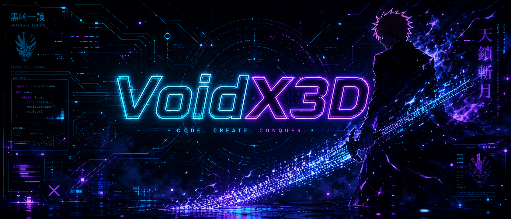

# 

# 
# 

  

  
  
  
  
  

---

## 🚀 Quick Navigation

- [About Me](#-about-me)
- [Tech Stack](#-tech-stack)
- [GitHub Stats](#-github-statistics)
- [Achievements](#-achievements--trophies)
- [Featured Projects](#-featured-projects--work)
- [2025 Goals](#-2025-goals--roadmap)
- [Connect With Me](#-connect-with-me)

---

## 🎯 About Me

I am VoidX3D, a passionate Full Stack Developer and Backend Engineer with 3+ years of self-taught experience. Based in Pokhara, Nepal 🇳🇵, I specialize in building production-ready systems, creating AI-powered tools & APIs, and shipping real projects that matter. My journey is fueled by a relentless curiosity and a commitment to continuous learning.

## 🎯 About Me - The Developer Behind the Code

I am **VoidX3D**, a passionate Full Stack Developer and Backend Engineer with a strong focus on building robust, scalable, and intelligent systems. With over **3 years of self-taught development experience**, I thrive on transforming complex ideas into functional and efficient solutions.

### Personal Information

| Attribute    | Detail                                     |
| :----------- | :----------------------------------------- |
| **Name**     | VoidX3D                                    |
| **Role**     | Full Stack Developer & Backend Engineer    |
| **Location** | Pokhara, Gandaki Pradesh, Nepal 🇳🇵         |
| **Education**| @ Motherland Secondary School     |
| **Age**      | 17                                         |
| **Experience**| 3+ years of self-taught development        |

### Interests & Focus Areas

My primary interests lie in the architecture and optimization of backend systems, seamlessly integrating AI/ML capabilities, and designing scalable solutions. I am constantly exploring new paradigms and technologies to stay at the forefront of innovation.

**Primary Focus:**
- Backend Architecture
- AI/ML Integration
- System Design
- API Development
- Real-time Applications
- Performance Optimization

**Currently Learning:**
- Advanced System Design
- Microservices Architecture
- Cloud Native Development
- Machine Learning Ops
- Blockchain Development
- Game Engine Development

**Hobbies:**
- Watching Anime (Bleach is peak ⚔️)
- Building Side Projects
- Contributing to Open Source
- Writing Technical Blogs
- Gaming & Game Development

My motivation is simple: "Code with passion, debug with patience, deploy with pride! 🎄"

---

## 🛠️ Tech Stack

My complete arsenal of technologies, from programming languages to databases, DevOps, and AI/ML tools. I am constantly expanding my knowledge and embracing new technologies to build robust and scalable solutions.

## 🛠️ Tech Stack - My Complete Arsenal

My technical expertise spans a wide array of programming languages, frameworks, databases, and tools. I am always eager to learn and adapt to new technologies to build innovative and efficient solutions.

### Programming Languages

  <table>
    <tr>
      <td align="center" width="96">
        
         JavaScript
      </td>
      <td align="center" width="96">
        
         TypeScript
      </td>
      <td align="center" width="96">
        
         Python
      </td>
      <td align="center" width="96">
        
         Java
      </td>
      <td align="center" width="96">
        
         C++
      </td>
      <td align="center" width="96">
        
         C#
      </td>
      <td align="center" width="96">
        
         Go
      </td>
    </tr>
    <tr>
      <td align="center" width="96">
        
         Kotlin
      </td>
      <td align="center" width="96">
        
         Swift
      </td>
      <td align="center" width="96">
        
         HTML5
      </td>
      <td align="center" width="96">
        
         CSS3
      </td>
      <td align="center" width="96">
        
         Bash
      </td>
    </tr>
  </table>

### Frontend Development

  <table>
    <tr>
      <td align="center" width="96">
        
         React
      </td>
      <td align="center" width="96">
        
         Next.js
      </td>
      <td align="center" width="96">
        
         Vue.js
      </td>
      <td align="center" width="96">
        
         Svelte
      </td>
      <td align="center" width="96">
        
         TailwindCSS
      </td>
      <td align="center" width="96">
        
         Bootstrap
      </td>
      <td align="center" width="96">
        
         Material-UI
      </td>
    </tr>
  </table>

### Backend Development

  <table>
    <tr>
      <td align="center" width="96">
        
         Node.js
      </td>
      <td align="center" width="96">
        
         Express.js
      </td>
      <td align="center" width="96">
        
         NestJS
      </td>
      <td align="center" width="96">
        
         FastAPI
      </td>
      <td align="center" width="96">
        
         Flask
      </td>
      <td align="center" width="96">
        
         Django
      </td>
      <td align="center" width="96">
        
         Spring Boot
      </td>
    </tr>
  </table>

### Mobile Development

  <table>
    <tr>
      <td align="center" width="96">
        
         React Native
      </td>
      <td align="center" width="96">
        
         Flutter
      </td>
      <td align="center" width="96">
        
         Kotlin
      </td>
      <td align="center" width="96">
        
         Swift
      </td>
      <td align="center" width="96">
        
         Android
      </td>
      <td align="center" width="96">
        
         iOS
      </td>
    </tr>
  </table>

### Databases & Storage

  <table>
    <tr>
      <td align="center" width="96">
        
         MongoDB
      </td>
      <td align="center" width="96">
        
         PostgreSQL
      </td>
      <td align="center" width="96">
        
         MySQL
      </td>
      <td align="center" width="96">
        
         Redis
      </td>
      <td align="center" width="96">
        
         Firebase
      </td>
      <td align="center" width="96">
        
         Supabase
      </td>
      <td align="center" width="96">
        
         SQLite
      </td>
    </tr>
  </table>

### DevOps & Cloud

  <table>
    <tr>
      <td align="center" width="96">
        
         Docker
      </td>
      <td align="center" width="96">
        
         Kubernetes
      </td>
      <td align="center" width="96">
        
         AWS
      </td>
      <td align="center" width="96">
        
         Azure
      </td>
      <td align="center" width="96">
        
         GCP
      </td>
      <td align="center" width="96">
        
         Jenkins
      </td>
      <td align="center" width="96">
        
         Nginx
      </td>
    </tr>
  </table>

### AI & Machine Learning

  <table>
    <tr>
      <td align="center" width="96">
        
         TensorFlow
      </td>
      <td align="center" width="96">
        
         PyTorch
      </td>
      <td align="center" width="96">
        
         Scikit-learn
      </td>
      <td align="center" width="96">
        
         OpenCV
      </td>
      <td align="center" width="96">
        
         Pandas
      </td>
      <td align="center" width="96">
        
         NumPy
      </td>
    </tr>
  </table>

### Tools & Others

  <table>
    <tr>
      <td align="center" width="96">
        
         Git
      </td>
      <td align="center" width="96">
        
         GitHub
      </td>
      <td align="center" width="96">
        
         VS Code
      </td>
      <td align="center" width="96">
        
         Linux
      </td>
      <td align="center" width="96">
        
         Vim
      </td>
      <td align="center" width="96">
        
         Figma
      </td>
      <td align="center" width="96">
        
         Postman
      </td>
    </tr>
  </table>

---

## 📊 GitHub Statistics

Here's a snapshot of my GitHub activity and contributions:

   
  
  

  
  
  

  

  
  
  

---

## 🏆 Achievements & Trophies

My journey as a developer is marked by continuous growth and the pursuit of excellence. Here are some of my key achievements and ongoing targets, visualized through GitHub trophies and a detailed milestone table.

  

### Milestones & Targets

| 🎯 Milestone      | 📊 Current Status                                             | 🎁 Target          | 🏅 Achievement       |
| :---------------- | :------------------------------------------------------------ | :----------------- | :------------------- |
| **Total Commits** |  | 2000+ by 2025      | 🌟 Code Warrior      |
| **Public Repos**  |     | 100+ Quality       | 🎁 Project Master    |
| **GitHub Stars**  |  | 1000+ Stars        | ⭐ Community Loved   |
| **Contributions** |  | Daily Commits      | ❄️ Consistent Builder |
| **Languages**     |  | Master 15+         | 🎅 Polyglot Dev      |
| **Followers**     |    | 500+ Network       | 🤝 Community Leader  |

---

## 🚀 Featured Projects & Work

Here are some of the projects I'm most proud of, showcasing my skills in AI, backend development, interactive applications, and web development. Each project represents a unique challenge and learning opportunity.

Dive deeper into my projects in [PROJECTS.md](./PROJECTS.md).

---

## 🎯 2025 Goals & Roadmap

My vision for 2025 involves significant growth in technical expertise, project contributions, and community engagement. I am committed to pushing my limits and achieving ambitious goals.

See my full roadmap and detailed goals in [GOALS.md](./GOALS.md).

---

## 🌐 Connect With Me

I'm always open to collaboration, tech discussions, and new opportunities. Feel free to reach out through any of the platforms below:

For more ways to connect, visit [CONNECT.md](./CONNECT.md).

---

## 💡 My Philosophy & Daily Routine

My approach to development is guided by a strong philosophy of continuous learning, clean architecture, and impactful contributions. My daily routine is structured to maximize productivity and foster growth.

Discover my full philosophy and routine in [PHILOSOPHY.md](./PHILOSOPHY.md).

---

### Thanks for visiting! 🌟

